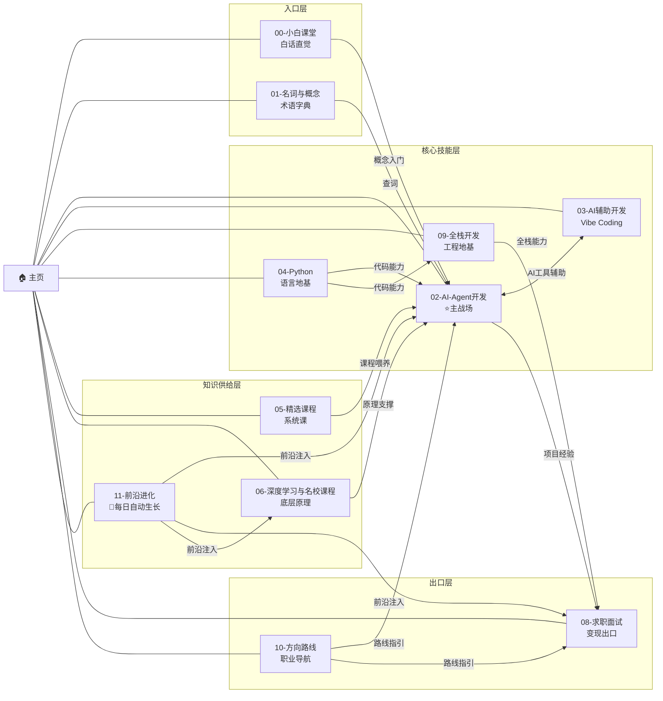
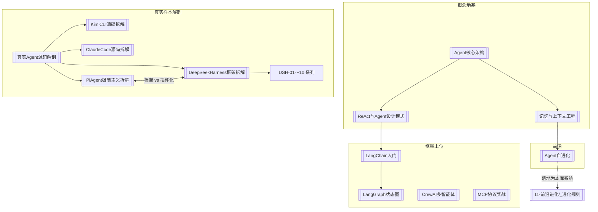

# 知识图谱总览

> [!note] 这是什么
> 整个知识库的**图谱中枢**：一张地图看懂 11 个领域的知识如何互相连接，以及「自进化系统」每天长了什么。Obsidian 里可配合左侧"关系图谱"视图使用——本页提供的是**带语义的导游图**。

## 一、全库知识地图

**读图口诀**：小白课堂和名词表是**门**，Python 和全栈是**地基**，Agent 开发是**主战场**，课程和名校课是**粮草**，前沿进化是**活水**，求职面试是**出口**，方向路线是**导航**。

## 二、主战场的内部结构（02-AI-Agent开发）

三大真实样本的哲学光谱：**Claude Code（稳健固定内核）→ DSH（万物皆插件）→ Pi（极简主义）**——天下 Agent 一个骨架（[[Agent核心架构]] 四要素），差别只在工程取舍。

## 三、自进化系统面板

> [!info] 本区块由每日进化循环自动更新
> 治理规则见 [[11-前沿进化/_进化规则]]（宪法），历史明细见 [[11-前沿进化/_进化日志]]。

| 指标 | 数值 |
| --- | --- |
| 系统启动日 | 2026-08-22 |
| 累计进化次数 | 1 |
| 累计产出笔记 | 3 篇 |
| 最近一次进化 | 2026-08-22（第1次） |
| 今日要点 | OpenAI 开源 Codex Harness（Harness 时代全面到来）；多智能体神话破灭论文；AI 人才价值重估白皮书 |
| 下次进化 | 每天 21:23 自动触发（Codely 运行时生效） |

## 四、怎么用这个知识库（给未来的你）

1. **日常学习**：从 [[主页]] 进 → 按目录主题走 → 迷路了回本页看地图
2. **查概念**：`01-名词与概念/名词速查表` 或 Obsidian `Ctrl+O` 快速切换
3. **看新东西**：`11-前沿进化/` 里日期最新的就是 AI 世界昨天发生了什么
4. **准备面试**：[[AI面试八股文]]（考什么）+ [[大厂AI面试题总览与答题方法论]]（怎么答）双剑合璧
5. **改进化行为**：直接编辑 [[11-前沿进化/_进化规则]]——它是你的系统宪法

## 相关笔记

- [[主页]]
- [[11-前沿进化/_进化规则]] / [[11-前沿进化/_进化日志]]
- [[Agent开发总览]] / [[课程总览]]
